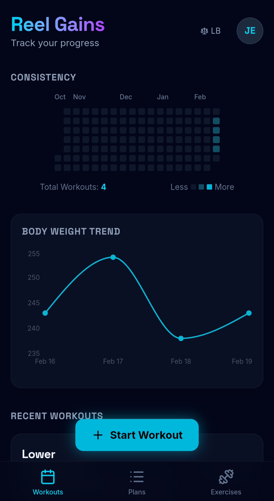
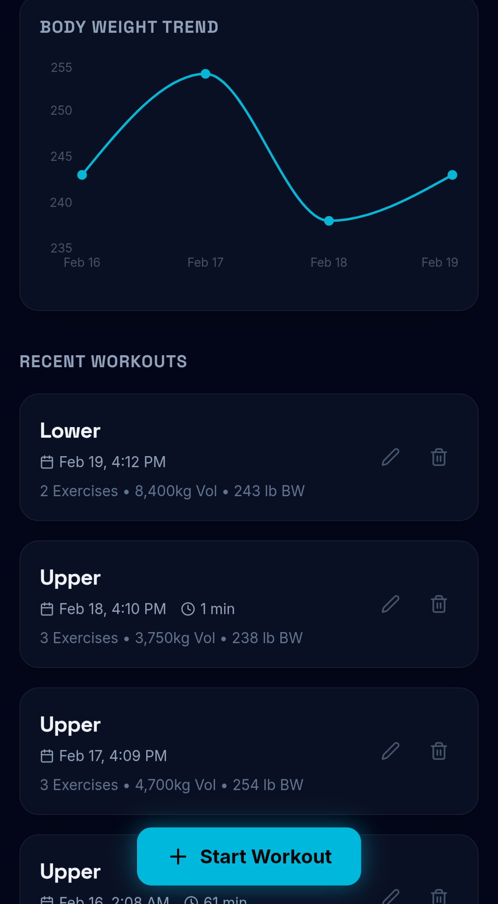
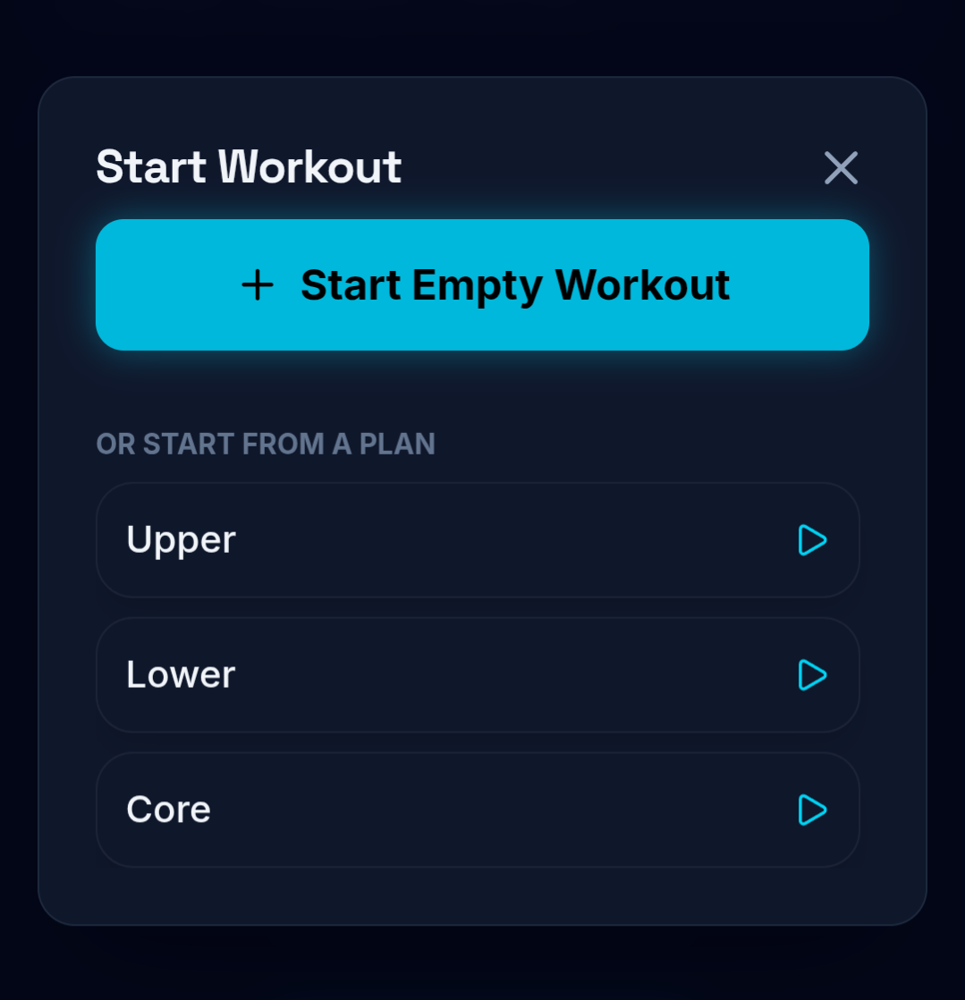
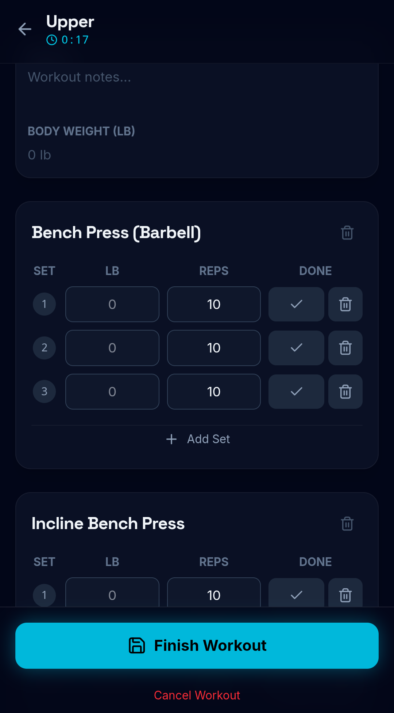
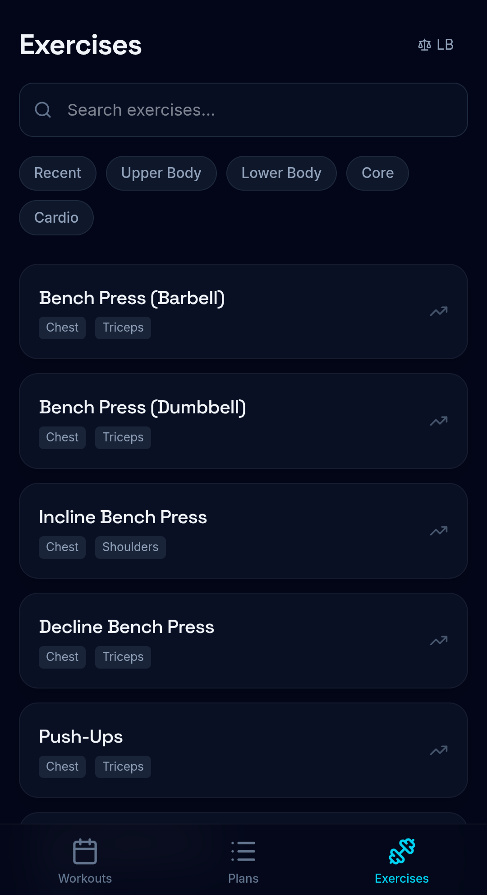
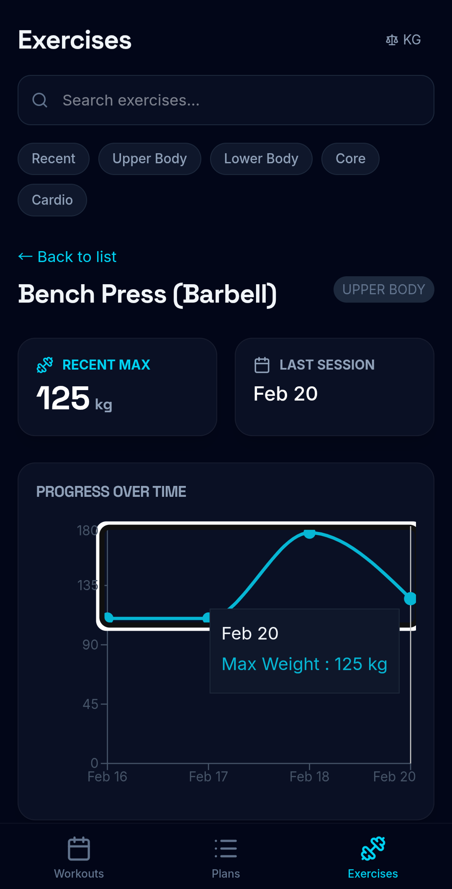

# Reel Gains

Track every rep. Catch every gain.

Reel Gains is the workout tracker that helps you stop floundering and start landing serious results. Cast your line, log your reps, and watch your progress swim into view with sleek charts and streaks that keep you hooked. Whether you're lifting like a tank or cruising through cardio, Reel Gains makes sure every workout is a big catch. No more drifting through routines, this is where effort meets ocean-deep motivation. So grab your gear, school your muscles, and reel in the strongest version of yourself.

# Screenshots

  
  
  
  
  
  
  

